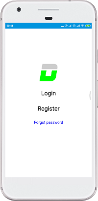
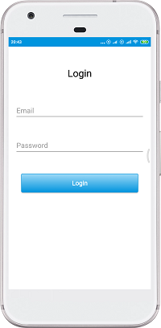
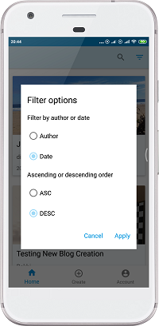
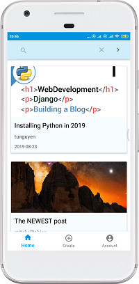
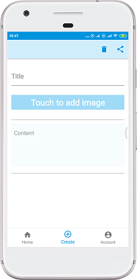
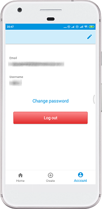

# Rest Api Demo - BlogPosts OpenAPI

 Demo app for testing RestApi Calls using MVI pattern. The app includes a login and register screen.

 The authentication is made through a token auto-generated by the server, when the user login or registers successfully.

 This token is then attached to the requests for making server calls and also used to check if the user is valid (logged) or invalid.

 Please note that less time was spent in the Design development. 

 

# Screenshots

  

   
   
  
# Libraries Used
 * 
<b> Navigation Component  </b> - Handle app navigation and graph overview.

 * 
<b>Lifecycles</b>- Create a UI that automatically responds to lifecycle events.

 * 
<b>LiveData</b> - Build data objects that notify views when the underlying database changes.

 * 
<b>Room</b> - Caching the network data for offline use.
 
 * 
<b>ViewModel</b> - Persist the data on configuration changes.

 * 
<b>RecyclerView </b> - Display list and handle clicks.

 * 
<b>Dagger 2</b> - For dependency injection.

 * 
<b>Kotlin coroutines</b> - Asynchronous tasks.

 * 
<b>Glide</b> - Image Loading.

 * 
<b>Retrofit</b> - Http Requests.
 
 * 
<b>Gson</b> - Convert Json objects.

 * 
<b>Leak Canary </b> - For leak analysis.

 * 
<b>Material Dialogs</b> - Create custom dialogs.

   
  
# Non-Goals
  
The main focus of this project was on HTTP requests and caching the data for offline use using the MVI pattern.

  
The UI was't developed for making the design look better, only added the necessary components to show the results.

   
  
# App architecture
  
The app was developed taking in account the best practices and recommended architecture from Google for building apps.

  
It uses the repository pattern and the single source of truth. Each component depends only on the component one level below it.
  For example, activities depend only on a view model. The repository is the only class that depends on multiple other classes.

  

    
  

   
   
   
   
   

### Disclaimer
###### The code was written as part of a course on android architecture and other components from <a href="http://https://codingwithmitch.com"> codingwithmitch.com</a>

